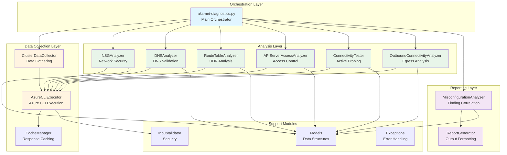
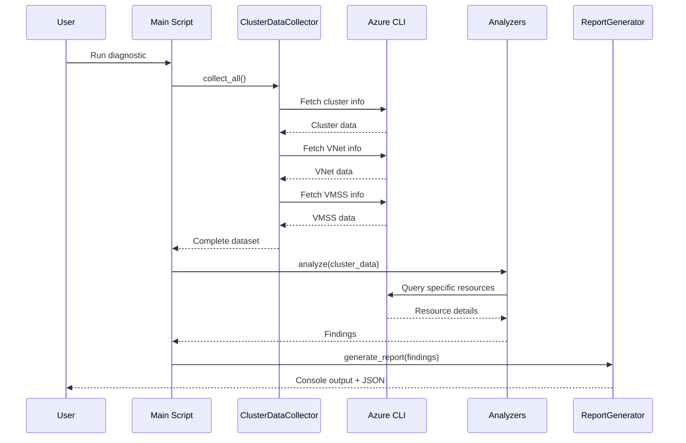
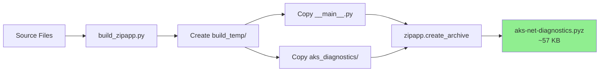
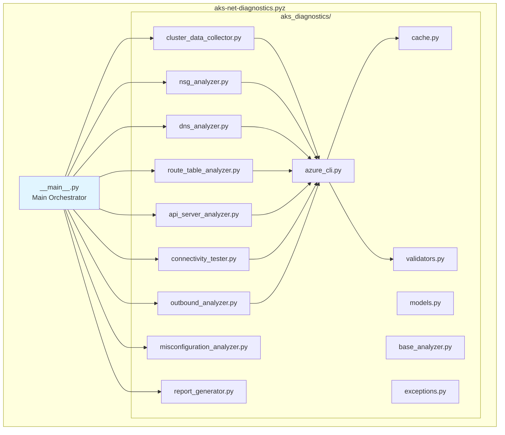
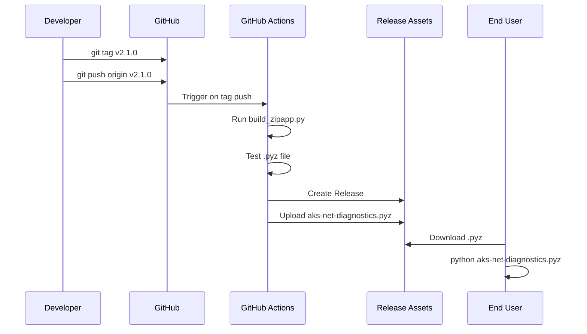

# Architecture Documentation

This document provides detailed technical information about the AKS Network Diagnostics tool architecture, design decisions, and module organization.

> **Note**: This document uses Mermaid diagrams for visual representation. If viewing on GitHub, the diagrams will render automatically. For local viewing, use a Markdown viewer that supports Mermaid (VS Code with Markdown Preview Mermaid Support extension, or online viewers like https://mermaid.live).

## 🏗️ Architecture Overview

### Design Philosophy

The tool follows a **modular, layered architecture** with clear separation of concerns:

1. **Orchestration Layer** - Main script coordinates the analysis workflow
2. **Data Collection Layer** - Gathers information from Azure
3. **Analysis Layer** - Specialized analyzers for different aspects
4. **Reporting Layer** - Formats and outputs findings

### High-Level Architecture



### Component Interaction Flow



## 📦 Module Breakdown

### Core Modules

#### 1. ClusterDataCollector
**Purpose**: Centralized data collection from Azure  
**Key Methods**:
- `collect_cluster_info()` - Fetches cluster and agent pool configuration
- `collect_vnet_info()` - Retrieves VNet topology and peerings
- `collect_vmss_info()` - Gathers VMSS network configuration
- `collect_all()` - One-call data gathering

**Dependencies**: AzureCLIExecutor  
**Used By**: Main orchestrator

#### 2. AzureCLIExecutor
**Purpose**: Execute Azure CLI commands with caching and error handling  
**Key Features**:
- Command validation and sanitization
- Response caching for performance
- Configurable timeouts
- Comprehensive error handling

**Dependencies**: CacheManager  
**Used By**: All analyzers, ClusterDataCollector

#### 3. CacheManager
**Purpose**: Cache Azure CLI responses to improve performance  
**Key Features**:
- In-memory caching
- Command-based cache keys
- Optional enable/disable

**Used By**: AzureCLIExecutor

### Analysis Modules

#### 4. NSGAnalyzer
**Purpose**: Network Security Group validation and compliance checking  
**Analyzes**:
- Required AKS outbound rules (MCR, Azure Cloud, DNS, NTP)
- Required inbound rules (inter-node, load balancer)
- Blocking rules and overrides
- Inter-node communication validation
- Service tag semantics

**Key Finding Codes**:
- `NSG_INTER_NODE_BLOCKED` - Rules blocking node-to-node traffic
- `NSG_BLOCKING_AKS_TRAFFIC` - Rules blocking required AKS traffic
- `NSG_POTENTIAL_BLOCK` - Potentially problematic rules

#### 5. DNSAnalyzer
**Purpose**: DNS configuration validation for public and private clusters  
**Analyzes**:
- Azure default DNS vs custom DNS
- Private DNS zone configuration
- VNet links for private clusters
- DNS forwarding requirements
- Custom DNS server reachability

**Key Finding Codes**:
- `PRIVATE_DNS_MISCONFIGURED` - Custom DNS can't resolve private zones
- `PDNS_DNS_HOST_VNET_LINK_MISSING` - Missing VNet link to DNS zone

#### 6. RouteTableAnalyzer
**Purpose**: User Defined Route (UDR) impact assessment  
**Analyzes**:
- Default route (0.0.0.0/0) presence
- Next hop types (VirtualAppliance, VirtualNetworkGateway, Internet)
- Impact on AKS management traffic
- Route propagation settings

**Key Finding Codes**:
- `ROUTE_DEFAULT_TO_FIREWALL` - UDR redirecting to firewall/NVA
- `ROUTE_OUTBOUND_OVERRIDE` - Routes affecting outbound connectivity

#### 7. APIServerAccessAnalyzer
**Purpose**: API server access control validation  
**Analyzes**:
- Authorized IP ranges configuration
- Public vs private cluster setup
- Outbound IP inclusion in authorized ranges
- Client IP access validation

**Key Finding Codes**:
- `API_OUTBOUND_NOT_AUTHORIZED` - Cluster IPs not in authorized ranges
- `API_CLIENT_NOT_AUTHORIZED` - Current client can't access API

#### 8. ConnectivityTester
**Purpose**: Active connectivity testing from cluster nodes  
**Tests**:
- MCR DNS resolution
- Internet HTTPS connectivity
- API server DNS resolution
- API server HTTPS connectivity

**Features**:
- VMSS run-command execution
- Dependency-aware test execution
- Configurable timeouts
- Detailed error reporting

**Key Finding Codes**:
- `CONNECTIVITY_DNS_FAILURE` - DNS resolution failed
- `CONNECTIVITY_HTTP_FAILURE` - HTTPS connectivity failed

#### 9. OutboundConnectivityAnalyzer
**Purpose**: Outbound configuration analysis  
**Analyzes**:
- Outbound type (LoadBalancer, NAT Gateway, UDR)
- Public IP configuration
- NAT Gateway settings
- Load balancer outbound rules
- UDR impact on outbound traffic

**Key Finding Codes**:
- `OUTBOUND_MISCONFIGURED` - Invalid outbound configuration
- `OUTBOUND_NO_PUBLIC_IP` - Missing public IP for outbound

### Reporting Modules

#### 10. ReportGenerator
**Purpose**: Format and output diagnostic reports  
**Outputs**:
- Console summary report
- Verbose detailed report
- JSON structured export

**Features**:
- Markdown formatting
- Finding severity icons
- Network topology visualization
- NSG rule formatting
- Test result presentation

#### 11. MisconfigurationAnalyzer
**Purpose**: Correlate findings and detect complex issues  
**Analyzes**:
- Cluster provisioning failures
- Node pool failures
- Connectivity test failures
- NSG compliance
- DNS misconfigurations

**Features**:
- Cross-component correlation
- Root cause analysis
- Actionable recommendations

### Utility Modules

#### 12. InputValidator
**Purpose**: Validate and sanitize user inputs  
**Validates**:
- Cluster names
- Resource group names
- Subscription IDs
- File paths
- Azure CLI command safety

**Features**:
- Pattern matching
- Length validation
- Security checks
- Path traversal prevention

#### 13. BaseAnalyzer
**Purpose**: Base class for all analyzers  
**Provides**:
- Common initialization
- Finding management
- Logger access
- Azure CLI executor access

#### 14. Models
**Purpose**: Data models and constants  
**Contains**:
- `Finding` - Finding data structure
- `FindingCode` - Finding type enumeration
- `Severity` - Severity levels
- `VMSSInstance` - VMSS instance model

#### 15. Exceptions
**Purpose**: Custom exception types  
**Defines**:
- `ValidationError` - Input validation failures
- `AzureCLIError` - Azure CLI execution errors

## 🔄 Data Flow

### 1. Initialization Phase

```
User Input → InputValidator → AKSNetworkDiagnostics.__init__
                                      ↓
                            AzureCLIExecutor + CacheManager
```

### 2. Data Collection Phase

```
Main Script → ClusterDataCollector → AzureCLIExecutor → Azure CLI
                                              ↓
                                        CacheManager
                                              ↓
                                     Cluster Info, Pools, VNets, VMSS
```

### 3. Analysis Phase

```
Main Script → NSGAnalyzer        → Findings
           → DNSAnalyzer         → Findings
           → RouteTableAnalyzer  → Findings
           → APIServerAnalyzer   → Findings
           → OutboundAnalyzer    → Findings
           → ConnectivityTester  → Findings (optional)
```

### 4. Correlation Phase

```
All Findings → MisconfigurationAnalyzer → Enhanced Findings
                                                ↓
                                    Root Cause Analysis
```

### 5. Reporting Phase

```
Enhanced Findings → ReportGenerator → Console Output
                                  → JSON Report (optional)
```

## 🎯 Design Principles

### 1. Single Responsibility Principle
Each module has one clear purpose:
- **ClusterDataCollector**: Only data fetching
- **NSGAnalyzer**: Only NSG validation
- **ReportGenerator**: Only output formatting

### 2. Dependency Injection
Modules receive dependencies through constructors:
```python
analyzer = NSGAnalyzer(
    azure_cli=self.azure_cli_executor,
    cluster_info=self.cluster_info,
    vmss_info=self.vmss_info
)
```

### 3. Testability
All modules are independently testable:
- Mock Azure CLI responses
- Inject test data
- Verify findings
- No external dependencies in tests

### 4. Extensibility
Easy to add new analyzers:
1. Create new analyzer class
2. Inherit from `BaseAnalyzer`
3. Implement `analyze()` method
4. Add to main script orchestration

### 5. Error Isolation
Errors in one analyzer don't break others:
- Try/catch in each analyzer
- Graceful degradation
- Partial results still useful

## 🔧 Extension Points

### Adding a New Analyzer

**Step 1**: Create the module

```python
# aks_diagnostics/my_analyzer.py
from aks_diagnostics.base_analyzer import BaseAnalyzer
from aks_diagnostics.models import Finding, FindingCode, Severity

class MyAnalyzer(BaseAnalyzer):
    def __init__(self, azure_cli, cluster_info):
        super().__init__(azure_cli, cluster_info)
    
    def analyze(self) -> Dict[str, Any]:
        # Fetch data
        data = self.azure_cli.execute(['some', 'command'])
        
        # Analyze
        if self._detect_issue(data):
            self.add_finding(Finding.create_error(
                FindingCode.MY_ISSUE,
                message="Issue detected",
                recommendation="Fix this way"
            ))
        
        return {"status": "analyzed"}
```

**Step 2**: Add to main script

```python
# In aks-net-diagnostics.py
from aks_diagnostics.my_analyzer import MyAnalyzer

def run(self):
    # ... existing code ...
    self.analyze_my_component()
    # ... existing code ...

def analyze_my_component(self):
    analyzer = MyAnalyzer(self.azure_cli_executor, self.cluster_info)
    results = analyzer.analyze()
    
    for finding in analyzer.get_findings():
        self.findings.append(finding.to_dict())
```

**Step 3**: Create tests

```python
# tests/test_my_analyzer.py
import unittest
from unittest.mock import MagicMock
from aks_diagnostics.my_analyzer import MyAnalyzer

class TestMyAnalyzer(unittest.TestCase):
    def setUp(self):
        self.mock_azure_cli = MagicMock()
        self.cluster_info = {"name": "test"}
        self.analyzer = MyAnalyzer(self.mock_azure_cli, self.cluster_info)
    
    def test_analyze_detects_issue(self):
        # Setup
        self.mock_azure_cli.execute.return_value = {"problem": True}
        
        # Execute
        result = self.analyzer.analyze()
        
        # Assert
        findings = self.analyzer.get_findings()
        self.assertEqual(len(findings), 1)
        self.assertEqual(findings[0].code, FindingCode.MY_ISSUE)
```

### Adding a New Finding Code

**Step 1**: Add to models

```python
# aks_diagnostics/models.py
class FindingCode:
    # ... existing codes ...
    MY_NEW_ISSUE = "MY_NEW_ISSUE"
```

**Step 2**: Use in analyzer

```python
self.add_finding(Finding.create_warning(
    FindingCode.MY_NEW_ISSUE,
    message="New issue detected",
    recommendation="How to fix",
    additional_data={"key": "value"}
))
```

## 🧪 Testing Strategy

### Unit Tests
- **Coverage**: 147 tests across all modules
- **Isolation**: Each test is independent
- **Mocking**: Azure CLI calls are mocked
- **Validation**: Test both success and failure scenarios

### Test Organization
```
tests/
├── test_api_server_analyzer.py    (22 tests)
├── test_cache.py                  (8 tests)
├── test_cluster_data_collector.py (14 tests)
├── test_connectivity_tester.py    (21 tests)
├── test_dns_analyzer.py           (18 tests)
├── test_models.py                 (7 tests)
├── test_nsg_analyzer.py           (22 tests)
├── test_route_table_analyzer.py   (24 tests)
└── test_validators.py             (11 tests)
```

### Test Patterns
```python
def test_component_when_condition_then_result(self):
    """Test description"""
    # Arrange
    setup_test_data()
    
    # Act
    result = component.do_something()
    
    # Assert
    self.assertEqual(expected, result)
```

## 📊 Performance Considerations

### Caching Strategy
- **Command-based**: Cache keyed by Azure CLI command
- **Optional**: Enable with `--cache` flag
- **In-memory**: Fast access, no disk I/O
- **Scope**: Per-session only

### Optimization Opportunities
1. **Parallel Queries**: VNet, VMSS, NSG queries could run in parallel
2. **Smart Caching**: Cache VNet info across multiple cluster analyses
3. **Incremental Analysis**: Skip unchanged components on re-run
4. **Streaming Output**: Start showing results before full analysis complete

### Current Performance
- **Typical Run**: 30-60 seconds for full analysis
- **With Cache**: 15-30 seconds on subsequent runs
- **With --probe-test**: +30-60 seconds for active tests

## 🔐 Security Considerations

### Input Validation
- All user inputs validated before use
- Path traversal prevention
- Command injection protection
- Length limits enforced

### Azure CLI Safety
- Command whitelist (account, aks, network, vmss, vm)
- No destructive operations
- Read-only access sufficient
- Subscription context validation

### Output Sanitization
- No sensitive data in console output
- JSON reports don't include secrets
- File permissions: 0600 (owner read/write only)

## � Distribution & Build Process

### Single-File Distribution (.pyz)

The tool is distributed as a **Python zipapp** - a single executable `.pyz` file containing all modules.

#### Build Process



#### What Gets Bundled



#### Release Workflow



#### Distribution Advantages

| Aspect | Modular Source | Single .pyz File |
|--------|---------------|------------------|
| **Size** | ~5,000 lines across 16 files | 57 KB single file |
| **Installation** | `git clone` required | Download one file |
| **Import Issues** | Possible (PYTHONPATH) | None (all bundled) |
| **Updates** | `git pull` | Download new .pyz |
| **Portability** | Requires directory structure | Single file, easy to share |
| **Development** | ✅ Ideal | ❌ Not editable |
| **End Users** | ❌ Complex | ✅ Simple |

#### Build Script Details

The `build_zipapp.py` script:
1. Creates temporary `build_temp/` directory
2. Copies `aks-net-diagnostics.py` as `__main__.py`
3. Copies `aks_diagnostics/` module (excluding `__pycache__`)
4. Uses `zipapp.create_archive()` to bundle with compression
5. Cleans up temporary directory
6. Outputs `aks-net-diagnostics.pyz` (~57 KB)

**Build time**: ~10 seconds  
**Compression**: gzip-compressed ZIP archive  
**Interpreter**: Shebang for `/usr/bin/env python3`

## �📝 Code Quality Metrics

### Maintainability
- **Main Script**: 451 lines (focused on orchestration)
- **Average Module**: ~300 lines (single responsibility)
- **Test Coverage**: 147 tests
- **Type Coverage**: 100% (all functions have type hints)

### Code Organization
- **Modules**: 16 files (clean separation)
- **Tests**: 9 test files (comprehensive coverage)
- **Documentation**: README, ARCHITECTURE, CONTRIBUTING

### Quality Standards
- ✅ Type hints on all functions
- ✅ Docstrings on all public methods
- ✅ Consistent error handling
- ✅ Uniform logging patterns
- ✅ No code duplication
- ✅ Clear naming conventions

---

**Last Updated**: October 2025  
**Version**: 2.1
